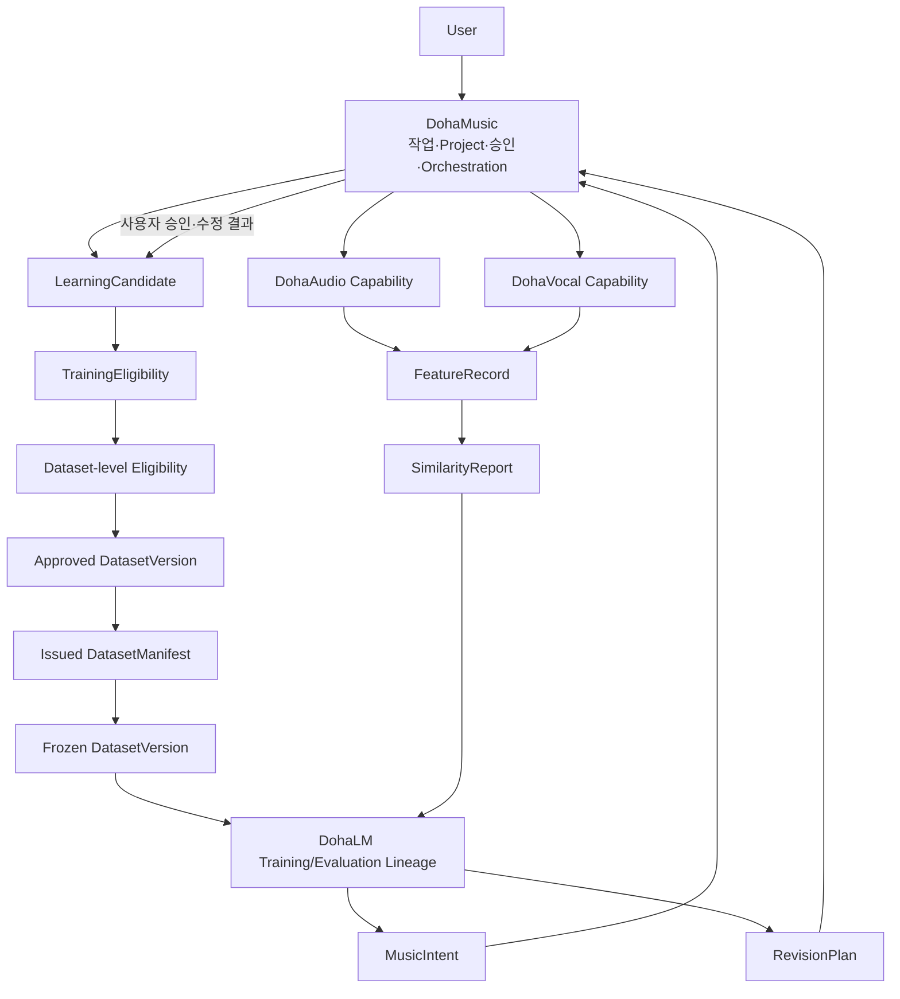
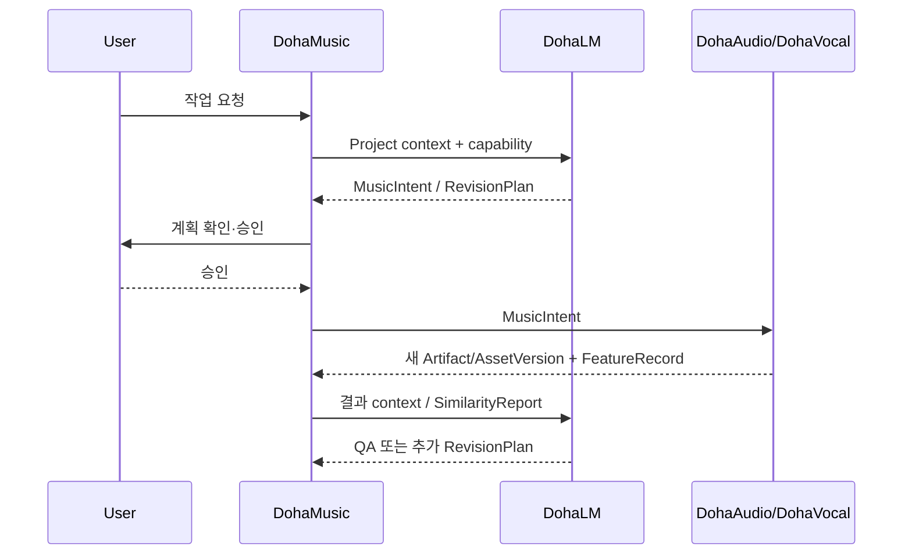
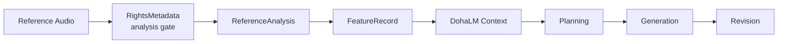
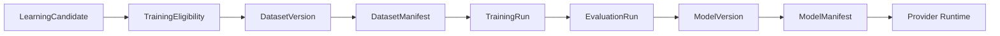

# AI Music Common Contracts Architecture

> 상태: [제안]
> 마지막 검토일: 2026-08-11

## 1. Ecosystem Architecture

이 순환은 자동 학습 loop가 아닙니다. Candidate 단위 TrainingEligibility와 DatasetVersion 집합 단위 eligibility·review·Manifest 발행·Freeze가 매 회전마다 필요합니다.

## 2. Intent 실행 흐름

## 3. Reference Analysis 흐름

원본은 접근 통제된 source 영역에 남으며 공통 객체에는 opaque reference와 fingerprint만 기록합니다.

## 4. Model Lineage

DatasetVersion/ModelVersion이 논리 권위이고 각 Manifest는 ID·checksum으로 결속된 발행 후 immutable evidence입니다. `training_allowed`, Dataset 집합 approval/freeze, EvaluationRun approval와 ModelVersion `runtime_allowed`를 독립 Gate로 유지합니다.

## 5. Compatibility Layer 우선 전략

기존 DohaLM REST/SSE와 Adapter Loader를 현재 Common Contract에 즉시 맞춰 재배치하지 않습니다. 후속 Repository mapping에서 compatibility layer가 기존 Runtime 입력·출력을 공통 객체로 변환한 뒤 소비자를 전환합니다. Directory Reorganization을 먼저 하면 contract mapping·rollback evidence 없이 import와 artifact path를 동시에 바꾸므로 위험합니다.

## 6. Failure Boundary

- 권리·lineage·schema가 불완전하면 fail closed합니다.
- Provider 실패는 MusicIntent나 기존 AssetVersion을 성공 상태로 바꾸지 않습니다.
- Similarity metric version이 호환되지 않으면 score를 만들지 않습니다.
- 권리 철회는 후속 Dataset/Model 영향 분석을 시작하지만 evidence를 삭제해 계보를 끊지 않습니다.
- issued Manifest는 payload·reference·digest가 달라져도 같은 ID로 수정하지 않고 새 Version/Manifest 또는 `supersedes` replacement를 발급합니다.
- Model `runtime_allowed=true`는 완료·승인 EvaluationRun, 승인 ModelVersion, valid ModelManifest, compatibility pass, 현재 rights eligibility와 non-deprecated 상태가 모두 참일 때만 유효합니다.

## 변경 이력

| 날짜 | 변경 내용 |
|---|---|
| 2026-08-11 | 사용자 작업·학습·Intent·Similarity·Revision의 순환 architecture 정의 |
