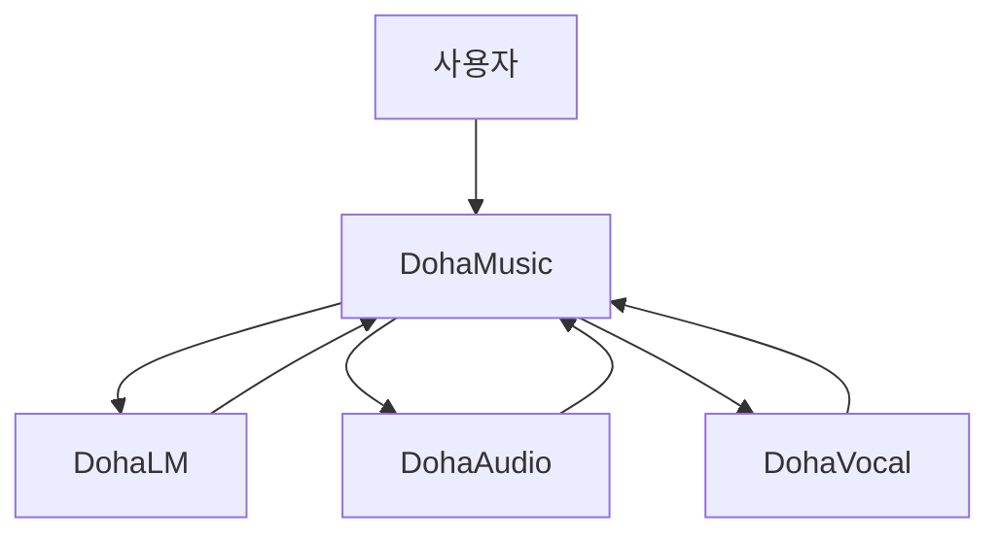

# Ecosystem Overview

> 문서 상태: [제안]

DohaStudio는 DohaMusic Product/Workspace와 세 독립 AI Provider로 구성됩니다.

화살표는 DohaMusic이 Job을 요청하고 Provider 결과를 회수하는 논리 흐름입니다. Provider끼리는 직접 호출하지 않습니다.

Workspace는 Project, Asset Library, immutable AssetVersion, Composition Snapshot, Mix와 Export를 관리합니다. Provider는 각 도메인의 Dataset, Model, Evaluation과 Runtime을 관리할 계획입니다.
