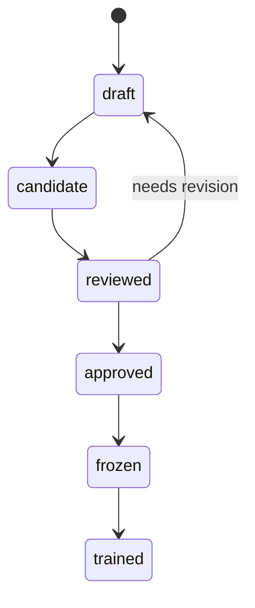

# LearningCandidate Specification

> 상태: [제안]
> 마지막 검토일: 2026-08-11

## 1. 역할

`LearningCandidate`는 사용자 작업, AI 결과, 수정 또는 선택을 학습 검토 대상으로 등록하는 객체입니다. 생성 자체는 Dataset 포함이나 학습 허용을 뜻하지 않습니다.

## 2. 필수 필드

| 필드 | 형식 | 의미 |
|---|---|---|
| `candidate_id` | string | immutable candidate ID |
| `source_type` | enum | 후보 생성 유형 |
| `task` | string | 학습 task taxonomy |
| `status` | enum | lifecycle 상태 |
| `input_refs` | object[] | 안전한 입력 identity |
| `output_refs` | object[] | 사용자 결과·수정 identity |
| `rights_metadata_id` | string | [RightsMetadata](12-rights-metadata.md) |
| `review_evidence_ids` | string[] | 검토 evidence |
| `content_fingerprint` | string | 원문을 노출하지 않는 identity |
| `parent_candidate_ids` | string[] | 수정·선호 lineage |

`schema_name`은 `learning_candidate`입니다.

## 3. Source Type

`human_authored`, `ai_generated`, `human_edited`, `preference`, `reference_analysis`, `similarity_revision`, `track_edit`, `section_edit`, `mix_edit`, `prompt_edit`, `planning`을 정의합니다.

## 4. Status

`draft`, `candidate`, `reviewed`, `approved`, `frozen`, `trained` 외 값은 허용하지 않습니다. `trained`는 최소 하나의 TrainingRun이 이 candidate가 포함된 DatasetVersion을 사용했음을 뜻하며 모델 승인을 뜻하지 않습니다.

## 5. 불변 조건

- `approved` 전에는 reviewer와 rights evidence가 필요합니다.
- `frozen` 이후 content가 달라지면 새 candidate를 발급합니다.
- `reference_analysis`는 원본 Reference Audio가 아니라 FeatureRecord/해석 결과만 output에 둘 수 있습니다.
- `human_edited`, `preference`, `similarity_revision`은 parent 또는 before/after lineage가 필요합니다.
- TrainingEligibility가 통과하기 전 DatasetVersion에 포함할 수 없습니다.

## 변경 이력

| 날짜 | 변경 내용 |
|---|---|
| 2026-08-11 | source type, lifecycle, rights/review와 parent lineage 정의 |
