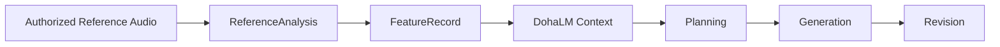

# ReferenceAnalysis Specification

> 상태: [제안]
> 마지막 검토일: 2026-08-11

## 1. 역할

`ReferenceAnalysis`는 승인된 Reference Audio를 분석해 FeatureRecord로 연결하는 작업·결과 identity입니다. DohaLM은 FeatureRecord를 context로 사용하며 원본 audio를 직접 학습하지 않습니다.

## 2. 필드

| 필드 | 필수 | 의미 |
|---|---:|---|
| `reference_analysis_id` | 예 | immutable ID |
| `source_reference` | 예 | 접근 통제된 원본의 opaque ID·fingerprint |
| `rights_metadata_id` | 예 | analysis/retention 권리 |
| `analysis_provider_id` | 예 | DohaAudio/DohaVocal provider identity |
| `provider_capability_id` | 예 | 사용 capability |
| `feature_record_ids` | 예 | 생성된 FeatureRecord 목록 |
| `analysis_status` | 예 | `requested`, `completed`, `failed`, `revoked` |
| `source_retention_status` | 예 | `temporary`, `project_retained`, `deleted`, `revoked` |
| `limitations` | 예 | confidence·누락 feature·비교 제한 |

`schema_name`은 `reference_analysis`입니다.

## 3. 불변 조건

- `analysis_allowed=true`가 아니면 분석을 시작할 수 없습니다.
- 원본 경로·binary·복원 가능한 payload를 객체에 넣지 않습니다.
- `completed`에는 최소 하나의 유효 FeatureRecord가 필요합니다.
- 원본이 삭제·철회되어도 기존 FeatureRecord의 장기 사용은 별도 retention/training 권리를 따릅니다.
- ReferenceAnalysis는 저작권 소유 또는 학습 권리의 증명이 아닙니다.

## 변경 이력

| 날짜 | 변경 내용 |
|---|---|
| 2026-08-11 | Reference Audio와 FeatureRecord 분리, 권리·retention 경계 정의 |
