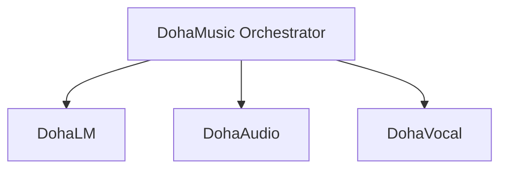

# 04. Provider 공통 계약

> 상태: [제안]
> 공식 문서 언어: 한국어
> HTTP Runtime 구현: Repository별 [계획] 또는 [미구현]

## 1. 목적

Provider 계약은 DohaLM, DohaAudio와 DohaVocal이 DohaMusic과 교환하는 공통 동작과 Metadata를 정의합니다. Transport와 endpoint는 구현별로 다를 수 있지만 의미 계약은 동일해야 합니다.

## 2. 호출 원칙

- DohaMusic만 Provider를 호출합니다.
- Provider끼리는 직접 호출하지 않습니다.
- Provider 결과의 결합, 사용자 권한, 최종 Selection과 GPU admission은 DohaMusic이 관리합니다.
- Local Runner와 Subprocess가 존재하더라도 같은 논리 계약을 따라야 합니다.

## 3. 공통 기능

| 기능 | 목적 |
|---|---|
| `GetCapabilities` | 지원 capability, 형식과 contract version 조회 |
| `CreateJob` | 비동기 Job 생성 |
| `GetJobStatus` | 상태와 progress 조회 |
| `CancelJob` | 취소 요청 |
| `RetryJob` | 명시적 재시도 생성 |
| `GetResult` | 출력 Artifact와 Version Metadata 조회 |
| `GetModelManifest` | 실행 모델 Manifest 조회 |
| `Health` | process 생존 여부 확인 |
| `Readiness` | 새 Job 수락 가능 여부 확인 |

## 4. 공통 요청 메타데이터

- `provider_id`
- `capability`
- `api_contract_version`
- `idempotency_key`
- `project_id`
- `input_asset_version_ids`
- `input_artifact_ids`
- `model_manifest_id`
- `settings_snapshot`
- `requested_by`

사용자 권한 검증에 필요한 식별자는 최소화하며 실제 개인정보와 로컬 경로를 전달하지 않습니다.

## 5. 공통 응답 메타데이터

- `job_id`, `status`, `progress_percent`
- `provider_id`, `api_contract_version`
- `output_artifact_ids`
- 출력 AssetVersion 생성을 위한 source/parent와 processing Metadata
- `model_manifest_id`
- 구조화된 `error`

## 6. 버전 관리와 호환성

Provider는 지원 contract version을 capability 응답에 명시합니다. 호환되지 않는 version 요청은 명확한 오류로 거부합니다. 필드 삭제·의미 변경은 새 major contract version에서 수행합니다.

## 7. 금지 사항

- Provider 간 직접 호출
- 응답에 로컬 절대 경로 또는 비밀정보 노출
- 실패를 성공 상태로 변환
- 기존 AssetVersion과 Artifact의 제자리 덮어쓰기
- 모델·라이선스·상업 이용 상태를 근거 없이 승인으로 표시

## 관련 명세

- [Job 계약](05-job-contract.md)
- [Model Manifest 명세](06-model-manifest-specification.md)
- [Artifact 명세](03-artifact-specification.md)
