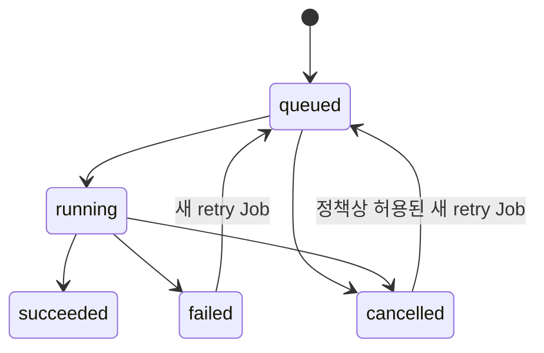

# 05. Job 공통 계약

> 상태: [제안]
> 공식 문서 언어: 한국어

## 1. 정의

Job은 Provider 또는 Workspace가 수행하는 비동기 작업의 불변 요청 snapshot과 상태 lifecycle입니다. 재시도는 기존 Job을 초기화하지 않고 새 Job을 생성합니다.

## 2. 공통 필드

| 필드 | 의미 |
|---|---|
| `job_id` | Job 식별자 |
| `job_type` | 작업 유형 |
| `status` | 공통 상태 |
| `provider_id` | 실행 Provider 또는 Workspace component |
| `api_contract_version` | 사용 계약 version |
| `progress_percent` | 0~100 progress. 알 수 없으면 별도 `null` 허용 정책 필요 |
| `input_asset_version_ids` | 불변 입력 Version 목록 |
| `input_artifact_ids` | 직접 입력 Artifact 목록 |
| `output_asset_version_ids` | 성공 후 등록된 출력 Version 목록 |
| `output_artifact_ids` | 생성 Artifact 목록 |
| `composition_snapshot_id` | 관련 Snapshot. 없을 수 있음 |
| `settings_snapshot` | 실행 시점의 불변 설정 |
| `model_manifest_id` | 실행 모델. 없을 수 있음 |
| `retry_of_job_id` | 원본 실패·취소 Job. 최초 시도는 없음 |
| `error` | 구조화된 오류. 성공 시 없음 |
| `created_at` | 생성 시각 |
| `started_at` | 시작 시각 |
| `completed_at` | 종료 시각 |

## 3. 공통 상태

- `queued`: 수락됐으나 실행 전
- `running`: 실행 중
- `succeeded`: 결과와 무결성 검증이 완료됨
- `failed`: 오류로 종료됨
- `cancelled`: 취소가 최종 반영됨

`succeeded`, `failed`, `cancelled`는 종료 상태입니다. 취소 요청과 최종 `cancelled`를 구분해야 하는 구현은 내부 또는 새 contract version에서 `cancel_requested`를 확장 상태로 정의할 수 있습니다.

## 4. Progress

`progress_percent`는 단조 증가를 권장하지만 모델 재시작·단계 변경 시 의미가 달라질 수 있으므로 `stage`와 함께 해석합니다. 100은 `succeeded`를 자동으로 의미하지 않으며 Artifact 검증 후 상태를 확정합니다.

## 5. Retry

- Retry는 새 `job_id`를 발급합니다.
- 원래 입력 Version, 설정과 모델을 그대로 쓸지 명시적으로 변경할지 기록합니다.
- 이전 실패 Job과 오류를 보존합니다.
- Retry 성공이 기존 실패 상태를 덮어쓰지 않습니다.

## 6. Error

`error`는 `error_code`, 한국어 사용자 메시지 또는 안전한 지역화 key, `retryable`, `stage`, `details_id`를 포함합니다. Stack trace, token, 개인 경로와 Dataset 내용을 외부 응답에 포함하지 않습니다.

## 7. 안전 원칙

실패·취소 Job은 입력 AssetVersion, 원본 Artifact와 다른 성공 후보를 삭제하지 않습니다. 부분 출력은 검증 전 임시 영역에 두고 성공 결과로 등록하지 않습니다.

## 관련 명세

- [Provider 계약](04-provider-contract.md)
- [AssetVersion 명세](02-asset-version-specification.md)
- [Composition Snapshot 명세](08-composition-snapshot-specification.md)
