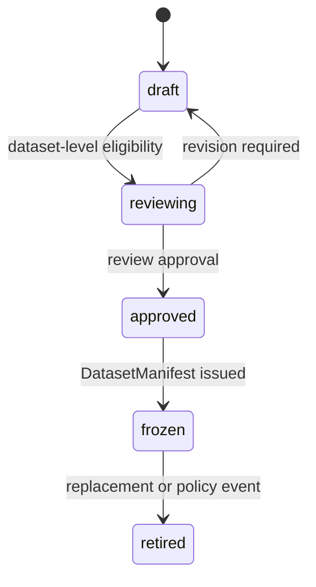

# DatasetVersion Specification

> 상태: [제안]
> 마지막 검토일: 2026-08-11

## 1. 역할

`DatasetVersion`은 승인된 LearningCandidate를 특정 task와 split로 동결한 불변 학습 입력입니다.

## 2. 필드

| 필드 | 의미 |
|---|---|
| `dataset_id` | 논리 Dataset ID |
| `dataset_version` | 불변 version |
| `status` | `draft`, `reviewing`, `approved`, `frozen`, `retired` |
| `usage_purpose` | 이 Version이 승인받는 구체적 학습 목적 |
| `task` | 단일 task 또는 명시적 multi-task manifest |
| `lineage` | candidate·source·processing reference |
| `created_from` | LearningCandidate ID 집합 fingerprint |
| `candidate_count` | 포함 candidate 수 |
| `split_manifest` | train/validation/test와 group policy |
| `schema_manifest_id` | record schema identity |
| `rights_summary` | 권리·consent 집계와 예외 0건 증거 |
| `dataset_eligibility_evidence_id` | 포함 집합 전체의 목적별 eligibility 검증 |
| `approval_evidence_ids` | Dataset review·approval evidence |
| `approved` | Dataset 사용 승인 |
| `frozen` | content/split/checksum 동결 |
| `training_allowed` | 특정 목적 학습 허용 |
| `dataset_manifest_id` | 발행된 immutable DatasetManifest |
| `content_fingerprint` | 정렬·직렬화 규칙이 고정된 checksum |
| `supersedes` | 대체 이전 version |

`schema_name`은 `dataset_version`입니다.

## 3. 불변 조건

- Candidate eligibility는 Dataset eligibility의 필요조건이지만 충분조건이 아닙니다.
- Freeze 전에 포함된 모든 candidate의 TrainingEligibility, purpose별 consent·rights·provenance·retention, 필요한 redistribution 권리, exclusion/revocation/replacement 최신 상태, split 중복·leakage와 전체 checksum을 집합 수준으로 다시 검증합니다.
- 포함 항목 하나라도 `unknown`, `missing`, `expired`, `revoked`, `ineligible`이면 DatasetVersion 전체를 fail closed합니다.
- `status=approved`에는 `approved=true`, 집합 eligibility pass와 approval evidence가 필요합니다.
- `status=frozen`에는 `approved=true`, `training_allowed=true`, 발행된 DatasetManifest와 Version/Manifest content identity 일치가 필요합니다.
- TrainingRun은 `status=frozen`, `approved=true`, `frozen=true`, `training_allowed=true`인 DatasetVersion만 사용할 수 있습니다.
- split은 source/user/project/reference group 누수를 차단합니다.
- item, preprocessing, split 또는 권리 판단 변경은 새 dataset version을 발급합니다.
- frozen DatasetVersion의 포함 항목·split·checksum을 제자리 수정하거나 revoked candidate만 삭제하지 않습니다. 새 Version과 `supersedes` lineage를 발급합니다.
- Freeze 후 권리 철회는 기존 Version·Manifest를 삭제하지 않고 append-only rights/lineage event와 replacement DatasetVersion으로 처리합니다.
- `reviewing`, `approved`, `frozen`, `retired` 전이는 append-only lifecycle event로 기록하고 current status는 그 projection입니다. frozen payload 자체를 수정하지 않습니다.
- Reference Audio binary·URI와 재현 가능한 원본 표현을 payload에 포함하지 않습니다.

## 4. Lifecycle과 발행 순서

공식 순서는 Candidate Review → Candidate TrainingEligibility → Draft Inclusion → Dataset-level Eligibility Validation → Dataset Review → DatasetVersion Approved → DatasetManifest Issued → Dataset Freeze → TrainingRun입니다.

## 변경 이력

| 날짜 | 변경 내용 |
|---|---|
| 2026-08-11 | candidate 기반 불변 Dataset version과 승인·동결·학습 Gate 정의 |
