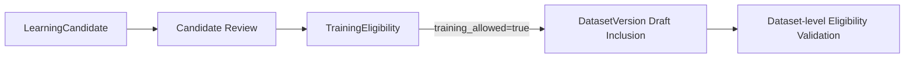

# TrainingEligibility Specification

> 상태: [제안]
> 마지막 검토일: 2026-08-11

## 1. 역할

`TrainingEligibility`는 LearningCandidate 또는 sample 하나가 특정 학습 목적의 DatasetVersion draft inclusion 대상이 될 수 있는지를 fail-closed로 판정하는 공통 Gate입니다. Dataset 집합 승인, Model 평가와 Runtime 승격은 이 객체의 책임이 아닙니다.

## 2. 필드

| 필드 | 의미 |
|---|---|
| `training_eligibility_id` | immutable 판정 ID |
| `candidate_id` | 대상 LearningCandidate |
| `candidate_status` | 검증 시 고정 상태 |
| `rights_metadata_id` | 권리 record |
| `policy_version` | 적용 eligibility policy |
| `usage_purpose` | 판정 대상 학습 목적 |
| `checks` | review, rights, provenance, consent, retention, purpose scope, quality, PII, lineage, reference-source separation |
| `approved` | review 승인 |
| `training_allowed` | 해당 목적의 Dataset draft inclusion 허용 |
| `decision` | `eligible`, `ineligible`, `needs_review`, `revoked` |
| `reason_codes` | 구조화된 판정 사유 |
| `reviewed_by`, `reviewed_at` | 승인 evidence |
| `expires_at` | 권리·정책에 따른 재검토 시각 |

`schema_name`은 `training_eligibility`입니다.

## 3. Gate

## 4. 불변 조건

- `candidate_status=approved`, 모든 필수 check pass, `approved=true`일 때만 해당 `usage_purpose`의 `training_allowed=true`가 가능합니다.
- Reference Audio 원본이 candidate payload에 있으면 `ineligible`입니다.
- 권리·provenance·consent·retention이 `unknown`, `missing`, `expired`, `revoked`이거나 목적 범위가 불일치하면 `training_allowed=false`입니다.
- Candidate `training_allowed=true`는 Dataset 집합 eligibility, Dataset 승인·Freeze, TrainingRun, Model 승인 또는 Runtime 사용을 의미하지 않습니다.
- TrainingEligibility에는 `runtime_allowed`, Runtime 승격, Model 배포·Evaluation 이후 적격성 판단 필드를 두지 않습니다.
- RightsMetadata가 revoked되면 기존 eligibility를 재사용하지 않습니다.
- policy, candidate fingerprint 또는 rights record가 바뀌면 새 판정을 발급합니다.
- 명시적인 current/supersession 계약 없이 같은 `(candidate_id, usage_purpose)` 판정이 둘 이상 존재하면 Dataset Gate는 순서와 무관하게 fail closed합니다.

## 변경 이력

| 날짜 | 변경 내용 |
|---|---|
| 2026-08-11 | Candidate 단위 학습 Gate로 책임 제한, Dataset 집합·Runtime Gate 분리 |
