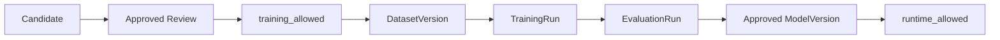

# TrainingEligibility Specification

> 상태: [제안]
> 마지막 검토일: 2026-08-11

## 1. 역할

`TrainingEligibility`는 LearningCandidate가 DatasetVersion과 학습으로 진입할 수 있는지를 fail-closed로 판정하는 공통 Gate입니다.

## 2. 필드

| 필드 | 의미 |
|---|---|
| `training_eligibility_id` | immutable 판정 ID |
| `candidate_id` | 대상 LearningCandidate |
| `candidate_status` | 검증 시 고정 상태 |
| `rights_metadata_id` | 권리 record |
| `policy_version` | 적용 eligibility policy |
| `checks` | rights, consent, quality, PII, leakage, lineage, reference-source separation |
| `approved` | review 승인 |
| `training_allowed` | Dataset/Training 진입 허용 |
| `runtime_allowed` | 파생 모델의 Runtime 고려 허용; 보통 evaluation 전 false |
| `decision` | `eligible`, `ineligible`, `needs_review`, `revoked` |
| `reason_codes` | 구조화된 판정 사유 |
| `reviewed_by`, `reviewed_at` | 승인 evidence |
| `expires_at` | 권리·정책에 따른 재검토 시각 |

`schema_name`은 `training_eligibility`입니다.

## 3. Gate

## 4. 불변 조건

- `candidate_status=approved`, 모든 필수 check pass, `approved=true`일 때만 `training_allowed=true`가 가능합니다.
- Reference Audio 원본이 candidate payload에 있으면 `ineligible`입니다.
- `runtime_allowed`는 candidate Gate만으로 true가 될 수 없으며 EvaluationRun과 ModelVersion 승인이 필요합니다.
- RightsMetadata가 revoked되면 기존 eligibility를 재사용하지 않습니다.
- policy, candidate fingerprint 또는 rights record가 바뀌면 새 판정을 발급합니다.

## 변경 이력

| 날짜 | 변경 내용 |
|---|---|
| 2026-08-11 | candidate→approved→training/runtime Gate와 fail-closed 조건 정의 |
