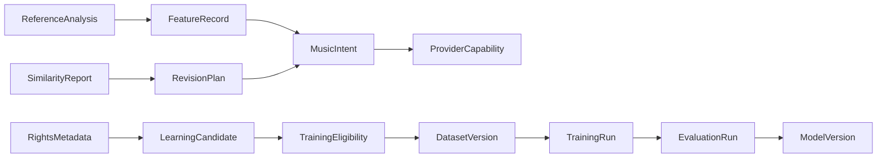

# AI Music Common Contracts Specification Index

> 상태: [제안]
> 공식 문서 언어: 한국어
> 마지막 검토일: 2026-08-11

## 목적

이 디렉터리는 DohaLM, DohaMusic, DohaAudio와 DohaVocal이 함께 사용하는 AI Music 공통 객체의 의미 계약을 정의합니다. JSON, Python, TypeScript, REST, Streaming과 DB 구현은 이 계약의 소비자이며 이번 PR 범위가 아닙니다.

## 공통 규칙

1. [공통 계약 규칙](00-contract-conventions.md)
2. [MusicIntent](01-music-intent.md)
3. [LearningCandidate](02-learning-candidate.md)
4. [ReferenceAnalysis](03-reference-analysis.md)
5. [FeatureRecord](04-feature-record.md)
6. [SimilarityReport](05-similarity-report.md)
7. [RevisionPlan](06-revision-plan.md)
8. [DatasetVersion](07-dataset-version.md)
9. [TrainingRun](08-training-run.md)
10. [EvaluationRun](09-evaluation-run.md)
11. [ModelVersion](10-model-version.md)
12. [ProviderCapability](11-provider-capability.md)
13. [RightsMetadata](12-rights-metadata.md)
14. [TrainingEligibility](13-training-eligibility.md)

## 객체 관계

## 상태 경계

- `[제안]`: 공통 계약 초안이며 Repository별 구현 완료를 뜻하지 않습니다.
- 객체의 `approved`, `training_allowed`, `runtime_allowed`는 서로 다른 Gate입니다.
- Reference Audio는 Dataset payload로 직접 승격하지 않습니다.
- Similarity 분석은 창작 지원 정보이며 법적 판정이 아닙니다.

## 변경 이력

| 날짜 | 변경 내용 |
|---|---|
| 2026-08-11 | AI Music 공통 객체 13종과 공통 규칙 인덱스 작성 |
