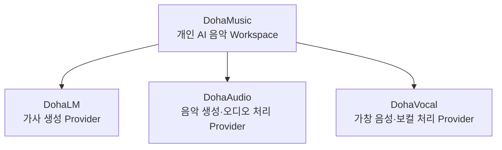
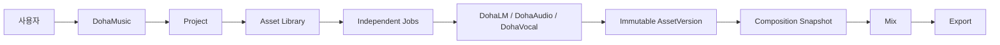

# DohaStudio AI 음악 생태계

DohaStudio는 가사, 음악, 보컬과 Workspace 제작 흐름을 분리된 저장소와 Provider로 구성하는 개인 AI 음악 생태계입니다.

> 현재 상태: Repository와 Architecture Foundation [제안]
> AI Runtime·Training·Provider API: 각 Repository Roadmap 기준 [계획] 또는 [미구현]

## 생태계

Provider끼리는 직접 호출하지 않습니다. 모든 Provider 선택, Job orchestration과 결과 결합은 DohaMusic을 통해 이루어집니다.

| 저장소 | 역할 |
|---|---|
| [DohaMusic](https://github.com/DohaStudio/DohaMusic) | 개인 AI 음악 Workspace, Project, Asset, Composition, Mix, Export |
| [DohaLM](https://github.com/DohaStudio/DohaLM) | 가사 생성·분석·수정 Provider |
| [DohaAudio](https://github.com/DohaStudio/DohaAudio) | 음악 생성·Stem 분리·오디오 분석 Provider |
| [DohaVocal](https://github.com/DohaStudio/DohaVocal) | 가창 음성·음색 변환·보컬 처리 Provider |

## Workspace 흐름

## 공통 원칙

- Immutable AssetVersion과 비파괴 파생 계보
- 로컬 절대 경로 대신 Artifact ID·URI 계약
- Model Manifest와 Dataset Manifest
- Versioned Provider Contract와 Provider Separation
- Commercial Review와 권리·라이선스 Gate
- Dataset, Checkpoint, 개인 음성과 Private Metadata의 Public Git 금지

## 로컬 영역

| Root | 역할 |
|---|---|
| `DohaProjects` | Git Repository와 코드·문서 |
| `DohaData` | Git 밖 Dataset |
| `DohaArtifacts` | Model, Checkpoint, Generation, Mix와 Export |
| `DohaTemp` | 재생성 가능한 Cache와 Temporary output |

## 더 읽기

- [Ecosystem Overview](../docs/ecosystem-overview.md)
- [Repository Boundary](../docs/repository-boundary.md)
- [Provider Contract](../docs/provider-contract.md)
- [Common Roadmap](../docs/common-roadmap.md)
- [Contribution](../CONTRIBUTING.md)
- [Security](../SECURITY.md)

구체적인 기능 상태, 모델, Dataset, API와 라이선스는 각 Repository 문서를 우선합니다.
